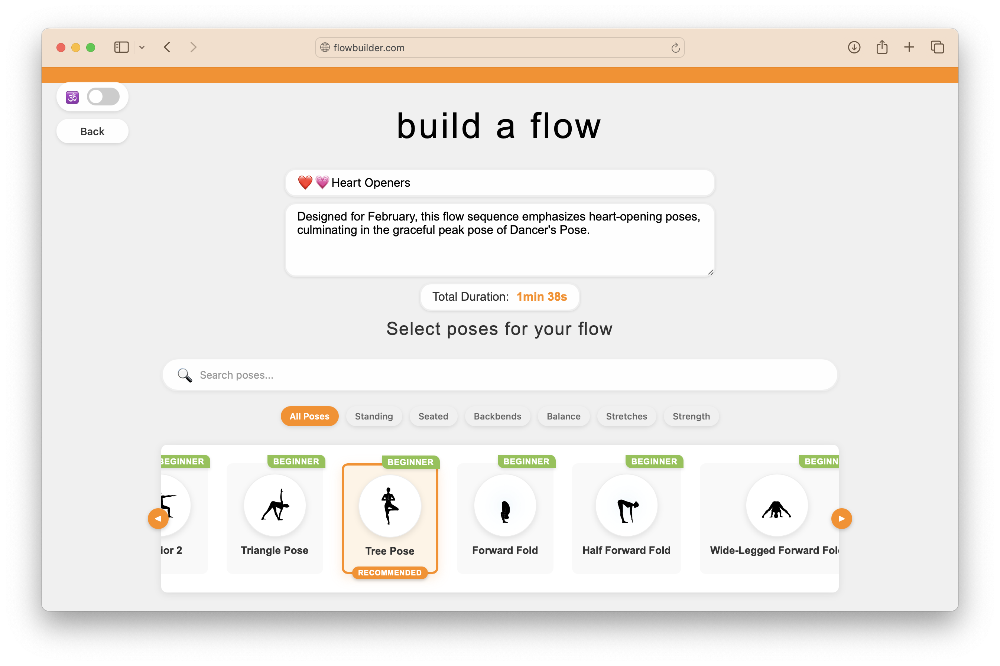
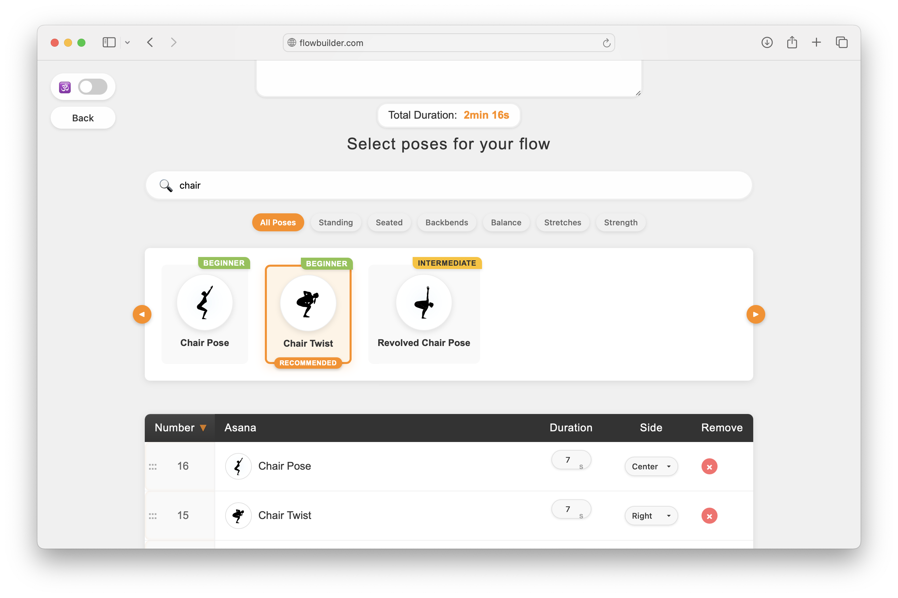
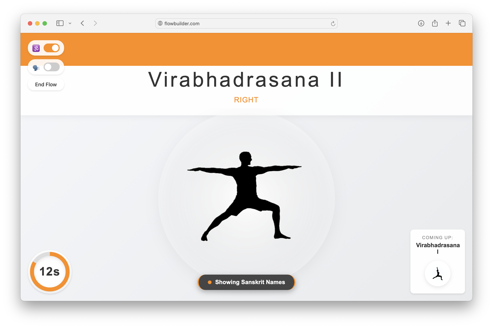

# Yoga Flow Builder

A web application for creating and practicing custom yoga flows.

## Demo

Try the live demo: [https://danielaja.github.io/flowBuilder/](https://danielaja.github.io/flowBuilder/)

## Screenshots

### Flow Builder Interface

*Main interface for building your yoga flow*

### Pose Search

*Search and filter through available yoga poses*

### Flow Practice - Sanskrit Names

*Practice mode showing Sanskrit pose names*

### Flow Practice - English Names

*Practice mode showing English pose names*

## Features

### Flow Creation
- Create and customize your own yoga flows
- Search and browse through an extensive library of yoga poses
- Filter poses by categories (Standing, Seated, Backbends, Balance, Stretches, Strength)
- Add poses to your flow with duration settings for each pose
- View total flow duration while building
- Save flows with custom names and descriptions

### Pose Library
- Comprehensive library of yoga poses with difficulty levels (Beginner, Intermediate)
- Visual pose representations with clear silhouette images
- Both English and Sanskrit names for poses
- Recommended poses highlighted for better guidance
- Search functionality to quickly find specific poses

### Practice Mode
- Practice saved flows with intuitive timing system
- Toggle between Sanskrit and English pose names
- Visual countdown timer for each pose
- Preview of upcoming poses
- End flows at any time with the End Flow button
- Track when flows were last practiced

### Technical Features
- Responsive design works on desktop and mobile devices
- Local storage persistence of created flows
- Clean, modern interface
- No account required - start creating flows immediately

## Getting Started

1. Clone the repository
2. Open `index.html` in your browser or use a local server
3. For development, the Live Server VSCode extension is recommended

## File Structure

- `index.html` - Main HTML structure
- `styles.css` - CSS styling
- `main.js` - JavaScript functionality
- `asanas.xml` - XML database of yoga poses
- `images/` - Directory containing pose images

## Usage

1. Browse the pose library
2. Click on poses to add them to your flow
3. Save your flow with a name
4. Practice your saved flows
5. Use the End Flow button to complete a practice session

## Technologies

- HTML5
- CSS3
- Vanilla JavaScript
- XML for data storage
- LocalStorage for persistence

## Contributing

Contributions are welcome! Please feel free to submit a Pull Request.

## License

This project is licensed under the MIT License - see the LICENSE file for details.